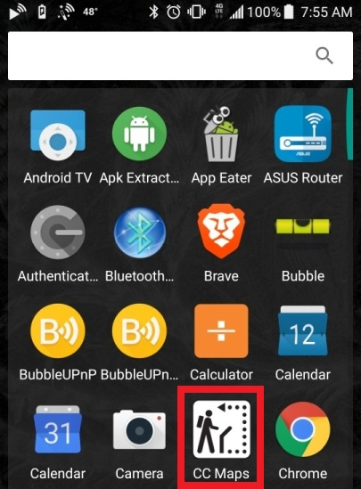
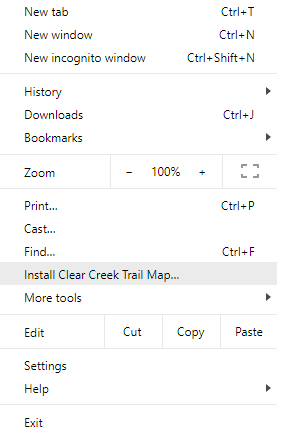

## Progressive <br>Web ~~Apps~~ Maps (PWA)

Malcolm Meyer

GIS Specialist | 
[City of Zanesville](https://gis.coz.org)

## Introductions

Your GIS origin story in two minutes or less...

## Goals
<ul style="none;">
<h4>Quick Overview of PWAs</h4>
<h4>Create a Basic Web Map</h4>
<h4>Turn this Map into a PWA</h4>
<h4>Make the PWA Installable</h4>
<h4>Allow the PWA to be used Offline</h4>
<h4>Host & Install the PWA</h4>
</ul>

## Time Allowing

<ul style="none;">
<h4>Add a Vector Tiles Basemap</h4>
<h4>Add Overlay Layers</h4>
</ul>

## What is a PWA
> Set of components to allow a website to behave more like a native application

## Benefits
Native App Behaviors

Custom App Colors

Caching & Offline Support

*Push Notifications

## Multi-Platform
Android

Chrome

Chromebooks

iOS

Windows Store

---

<iframe src="https://www.pwastats.com" width="100%" height="500px"></iframe>

## Why a PWA Map?

* Cached Assets for Landing Pages & Map UI
* Offline Maps for Field Use - No App Required
* User Convenience - App Drawer/Homescreen

Notes: Let's look at how my sample PWA app looks and take a look at the install process

## Example PWA Map
[https://pwa-trails.netlify.com](https://pwa-trails.netlify.com)

<iframe src="https://pwa-trails.netlify.com" width="100%" height="400px"></iframe>

---


---


---



---



---


---


## Code Break

Notes: https://www.smashingmagazine.com/2016/02/making-a-service-worker/

## Step 1. Install

```javascript
/*
https://github.com/reyemtm/pwa-maps/archive/master.zip
*/
```
```javascript
/*
unzip and open the folder with VS Code
CTRL + '`' to open the terminal
*/
```

```
npm install
```

```
npm run build

```

```
npm start
```

Notes: Installs some dependencies and copies a basic webmap to the public folder

---


Note: We have a basic webmap, but the manifest.json and service worker fail to load, however some tests in the Audit PWA test will pass

## Goals

<ul style="none;">
<h4>Quick Overview of PWAs</h4>
<h4>Create a Basic Web Map</h4>
<h4>Turn this Map into a PWA</h4>
<h4>Make the PWA Installable</h4>
<h4>Allow the PWA to be used Offline</h4>
<h4>Host & Install the PWA</h4>
</ul>

## Step 2. Test
```javascript
//CTRL + SHIFT + i then Audit Tab
```

* Progressive Web App Audit in Chrome
* Check 'Offline' in the Applcation Tab

## <span style="color:firebrick;">Errors!!</span>

* No manifest
* No service worker
* App does not work offline

## Let's Look at the Elements of a PWA
- manifest.json
- service-worker.js
- *Mobile First Design
- *Progressive Enhancement

## manifest.json
```javascript
/* https://app-manifest.firebaseapp.com/ */
```

```
{
  "name": "Clear Creek Trail Map",
  "short_name": "CC Maps",
  "scope": "/",
  "start_url": "/",
  "icons": [
    {
      "src": "/img/trails512.png",
      "type": "image/png",
      "sizes": "512x512"
    }
  ],
  "background_color": "#d8e8c8",
  "theme_color": "#d8e8c8",
  "display": "standalone"
}

```

## Test Again

* Passes manifest tests
* No service-worker
* No offline support

## Service workers
> ...intercept and handle network requests, including programmatically managing a cache of responses.

## service-worker.js

```javascript
/* 
create an empty sw.js file in the root of 'public'
*/
```

```
<!--register the service worker-->
<script>
  if ('serviceWorker' in navigator) {
    navigator.serviceWorker
      .register('/sw.js')
      .then(function () {
        console.log("Service Worker Registered");
      });
  }
</script>
```

## <span style="color:#28a745;">Success!</span>
* Installable
* PWA optimized
* Still no offline support
* No service worker caching

## Adding Offline Cache

[https://css-tricks.com/serviceworker-for-offline/](https://css-tricks.com/serviceworker-for-offline/)

```javascript
npm run cache 
```
```javascript
/*
this will simply copy a prepared service
worker - 'sw.js' to the public folder 
*/
```

Notes: take a look at the service worker file and go through the various functions

## Service Worker Test
* Installable
* PWA optimized
* Offline support
* But that's not much of a map...

## OpenMapTiles

<h4>Creating an Extract</h4>
- Download a prepared OpenMapTiles extract
- Create a GeoJSON to clip the extract
- Install the Node JS Package ``mbtiles-extracts``
  - Edit it to allow for not passing in a property name
- Unpack raw vector tiles from mbtiles
  - https://www.npmjs.com/package/mbtiles2ungzpbf

Notes: Is anyone familiar with vector tiles? OpenMapTiles provides tools to build custom extracts of OpenStreetMap and pre-built area extracts 

```
npm run copy
```
```javascript
/*
this will copy the OpenMapTiles data, 
the basemap style and the trails
GeoJSON data to the public folder
*/
```
## Workbox

```
npm install workbox-cli /* this is already installed */
```
Over 500 files with the vector tile data

All files must be cached for offline support

Use the workbox-cli to automate the creation of the ``sw.js`` file

## Workbox Commands

```
npm run workbox-wizard
```

```
npm run workbox-cache
```

```
/*
you could use the native cli commands if installed globally
*/
```

Notes: I just added some simple node scripts to run the workbox-cli without needing to install it globally. Workbox replaces the now deprecated sw-precache tool, also by Google.

## Publish to Netlify

**Delete the ``.netlify`` folder!!**
```
npm run deploy
```
```
/* 
choose the public folder
*/
```

## Thanks

<h3>Malcolm Meyer</h3>

malcolm.meyer@coz.org